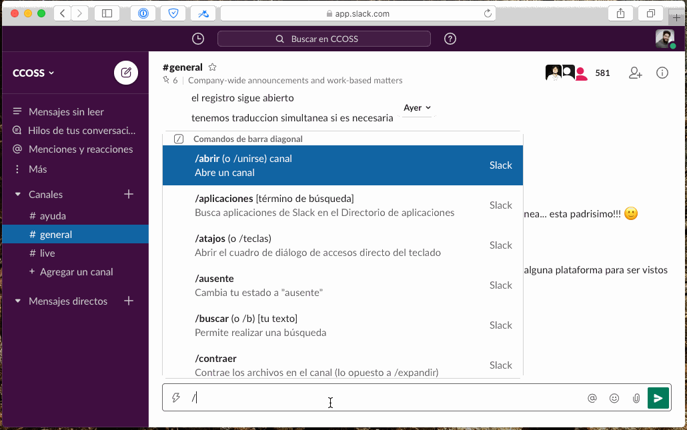

# Slack Channels / Canales

Para unirse a otros canales en Slack, pueden usar el selector de canales, o el comando `/abrir` o `/open` dependiendo del idioma en que este configurado su navegador o su Slack.

## En Español

Puedes unirte a un canal usando el selector de canales, es un simbolo de `+` en la barra lateral justo donde dice `Canales`.

Tambien puedes abrir el selector de canales escribiendo el comando `/abrir` y presionando Enter en tu teclado como si fueras a mandar un mensaje.

Y finalmente, si conoces el nombre del canal, puedes usarlo directamente con el comando `/abrir` seguido por el nombre del canal con un `#` al principio, por ejemplo `#ayuda` o `#random`.

## En Inglés

Puedes unirte a un canal usando el selector de canales, es un simbolo de `+` en la barra lateral justo donde dice `Channels`.

Tambien puedes abrir el selector de canales escribiendo el comando `/abrir` y presionando Enter en tu teclado como si fueras a mandar un mensaje; si conoces el nombre del canal, puedes usarlo directamente con el comando `/open` seguido por el nombre del canal con un `#` al principio, por ejemplo `#ayuda` o `#random`.

